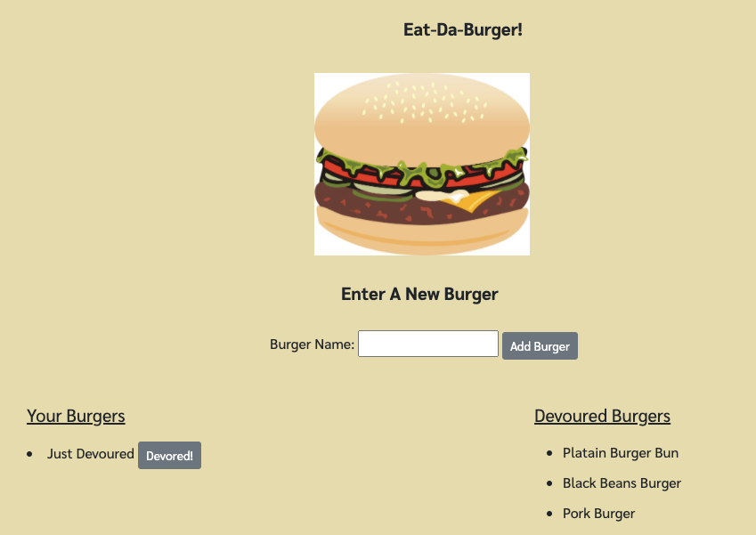

# burger_logger
Add the name of your favorite or dream burger to create a list. Click on the devoured! button when you finish eating your burger. This application runs with Express and Handlebars

# How it works
To run this application you will need to install the fallowing NMP packages:
* MySQL
* Express
* Handlebars 
* MySQL
* Handlebars

Please install the NPM package, use the schema and seed files to create your datadase and table. Update line 8 of your connection file under the config folder with your MySQL password.

Run server.js file and start adding burgers!

# Screenshot

# Repositories:
* Github: https://github.com/CivicaJR91/burger_logger
* Heruku: https://git.heroku.com/thawing-taiga-56965.git
